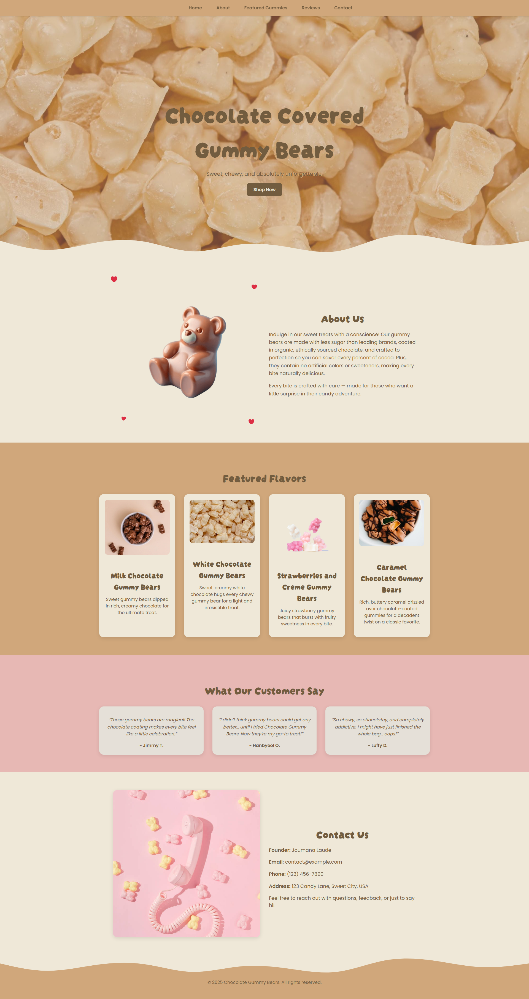

# 🍫🐻 Chocolate Covered Gummy Bears - WordPress Theme

A custom WordPress theme I built from scratch for showcasing the WordPress template hierarchy, PHP structure, and enqueuing.
Includes a responsive navigation menu with a hamburger toggle, styled with custom colors and typography.

---

## 🚀 Features
- Fully responsive layout
- Mobile-friendly hamburger navigation
- Fixed header with smooth scrolling section highlights
- Customizable via WordPress Dashboard
- Clean, modern design inspired by chocolate gummy bears

---

## 📂 File Structure
```
gummies/
├── assets/
│   ├── css/          # Theme styles
│   ├── js/           # Main JavaScript (menu, scroll, etc.)
│   └── images/       # Theme images
│
├── footer.php
├── functions.php
├── header.php
├── index.php
├── style.css         # Theme stylesheet with WP theme metadata
└── README.md
```

---

## ⚙️ Installation
1. Clone or download this repository.
2. Copy the folder into your WordPress themes directory: /wp-content/themes/chocogummybears/
3. Log into your WordPress Admin Dashboard.
4. Go to **Appearance → Themes** and activate **Chocolate Gummy Bears**.
5. Assign your **Primary Menu** under **Appearance → Menus**.

---

## 📝 Notes
- Requires WordPress 5.0+
- Make sure `<?php wp_head(); ?>` is in your header and `<?php wp_footer(); ?>` is in your footer so scripts load properly.
- Tested with PHP 8+.

---

## 👀🩷 Preview

